<!-- generated by scripts/render-profile.mjs; edit the script, not this file -->

<p align="center">
  
</p>

# Tin Luong

Data Scientist and AI Engineer based in Melbourne, Australia.

I build analytics and AI systems that turn raw data, documents, and APIs into validated, stakeholder-ready decisions. My work sits across business intelligence, data pipelines, RAG systems, and Python automation for operational data problems.

<p>
  <a href="https://tin-luong-portfolio.netlify.app"></a>
  <a href="https://www.linkedin.com/in/tin-luong"></a>
  <a href="mailto:tin.bao.luong@gmail.com"></a>
</p>

## Live Metrics

<p>
  
  
  
  
  
</p>

<p align="center">
  
</p>

## Current Focus

- Business intelligence, KPI reporting, and dashboard-ready analytics marts
- Python and SQL pipelines for cleaning, validating, and transforming data
- RAG and document intelligence for cited, source-grounded answers
- API integrations and typed tool interfaces for analyst workflows
- Applied AI for decision support, not generic demos

## Building Now

### [tin-luong-portfolio](https://github.com/Finn043/tin-luong-portfolio)

Personal portfolio site for analytics, BI, and applied AI work.

**Stack:** TypeScript  
**Updated:** 2026-08-25  

### [retail-electronics-analytics](https://github.com/Finn043/retail-electronics-analytics)

Python analytics project that transforms raw product review data into product, rating, review-volume, and data-quality insights for BI reporting.

**Stack:** Python  
**Updated:** 2026-07-02  

### [macrobrief](https://github.com/Finn043/macrobrief)

Economic insight tool that fetches macroeconomic time-series data, compares indicators, detects trend shifts, and generates stakeholder-ready briefs.

**Stack:** Python  
**Updated:** 2026-08-22  

### InsightRAG

Business document intelligence system for querying reports, KPI definitions, policies, and analytics specs with hybrid retrieval and cited answers.

**Planned stack:** FastAPI, React, vector search, BM25, reranking, source citations, retrieval evaluation.

## Project Direction

```text
Raw data / documents / APIs
  -> ingestion
  -> validation
  -> transformation / retrieval / modeling
  -> BI-ready marts or cited AI answers
  -> stakeholder-facing dashboards and reports
```

## Technical Stack

| Area | Technologies |
| --- | --- |
| Data |     |
| Cloud and Engineering |     |
| Analytics and BI |   |
| AI and ML |    |

**Languages:** Python, SQL, TypeScript  
**Analytics:** Pandas, NumPy, Power BI, Tableau, Looker, Excel  
**Data:** PostgreSQL, BigQuery, Snowflake, DuckDB, dbt  
**AI:** RAG, LangChain, vector search, prompt engineering, evaluation  
**Backend & Tools:** FastAPI, Docker, GitHub Actions, REST APIs

## Experience Themes

- Built KPI dashboards and data models for business teams using Looker and BigQuery
- Developed Python automation for validation, QA, and analytics workflows
- Worked with production data pipelines processing high-volume operational data
- Delivered stakeholder-facing insights across product, customer success, and executive audiences

## Repository Languages

| Language | Count |
| --- | ---: |
| Python | 5 repos |
| JavaScript | 4 repos |
| TypeScript | 2 repos |
| HTML | 2 repos |

## Contact

- Portfolio: [tin-luong-portfolio.netlify.app](https://tin-luong-portfolio.netlify.app)
- LinkedIn: [linkedin.com/in/tin-luong](https://linkedin.com/in/tin-luong)
- Email: [tin.bao.luong@gmail.com](mailto:tin.bao.luong@gmail.com)

<sub>Last rendered: 2026-09-08. Metrics refresh daily with GitHub Actions.</sub>
